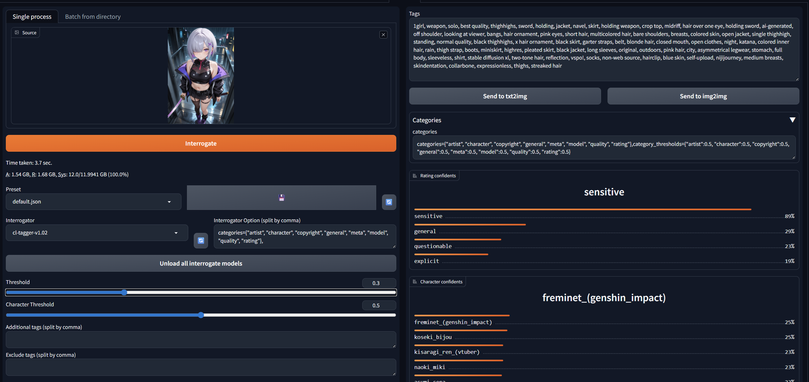

# Tagger for [Automatic1111's WebUI](https://github.com/AUTOMATIC1111/stable-diffusion-webui) & [Stable Diffusion WebUI Forge - Neo & Classic](https://github.com/Haoming02/sd-webui-forge-classic)

Interrogate booru style tags for single or multiple image files using various models

This branch is a fork of WD14Tagger maintained by @Akegarasu

### Tagger（interrogate model）
- [pixai-tagger-v0.9](https://huggingface.co/deepghs/pixai-tagger-v0.9-onnx)
- [OppaiOracle-v1.1](https://huggingface.co/Grio43/OppaiOracle)
- [camie-tagger-v2](https://huggingface.co/Camais03/camie-tagger-v2)
- [WD EVA02-Large Tagger v3](https://huggingface.co/SmilingWolf/wd-eva02-large-tagger-v3)
- [WD ViT-Large Tagger v3](https://huggingface.co/SmilingWolf/wd-vit-large-tagger-v3)
- [WD SwinV2 Tagger v3](https://huggingface.co/SmilingWolf/wd-swinv2-tagger-v3)
- [WD ConvNext Tagger v3](https://huggingface.co/SmilingWolf/wd-convnext-tagger-v3)
- [WD ViT Tagger v3](https://huggingface.co/SmilingWolf/wd-vit-tagger-v3)
- [IdolSankaku EVA02-Large Tagger v1](https://huggingface.co/deepghs/idolsankaku-eva02-large-tagger-v1)
- [IdolSankaku SwinV2 Tagger v1](https://huggingface.co/deepghs/idolsankaku-swinv2-tagger-v1)
- [ML-Danbooru m36_dec-5-97527](https://huggingface.co/deepghs/ml-danbooru-onnx)
- [ML-Danbooru m36_dec-3-80000](https://huggingface.co/deepghs/ml-danbooru-onnx)
- [CL tagger v1.02](https://huggingface.co/cella110n/cl_tagger)
- [PixAI Tagger v0.9 (with EVA02-Large Encoder)](https://huggingface.co/etset/pixai-tagger-v0.9E)

### Add Feater
  - `Interrogator Option`
      - 'categories'
         - Set the specified categories as the output targets. 
         - ex) categories=('artist','character','copyright','general','meta','rating','year') 
      - 'category_thresholds'
         - Set a threshold for each specified category. By default, all categories use the same threshold.
         - ex) category_thresholds={"artist":0.5,"character":0.8,"copyright":0.7,"general":0.3,"meta":0.2,"rating":0.5,"year":0.2} 

## Installation
1. *Extensions* -> *Install from URL* -> Enter URL of this repository -> Press *Install* button
   - or clone this repository under `extensions/`
      ```sh
      $ git clone https://github.com/szxex/stable-diffusion-webui-wd14-tagger.git extensions/tagger
      ```

1. *(optional)* Add interrogate model
   - #### [*Waifu Diffusion 1.4 Tagger by MrSmilingWolf*](docs/what-is-wd14-tagger.md)
      Downloads automatically from the [HuggingFace repository](https://huggingface.co/SmilingWolf/wd-v1-4-vit-tagger) the first time you run it.

1. Start or restart the WebUI.
   - or you can press refresh button after *Interrogator* dropdown box.
   - "You must close stable diffusion completely after installation and re-run it!"


## Model comparison
[Model comparison](docs/model-comparison.md)

## Screenshot



## Copyright

Public domain, except borrowed parts (e.g. `dbimutils.py`)
